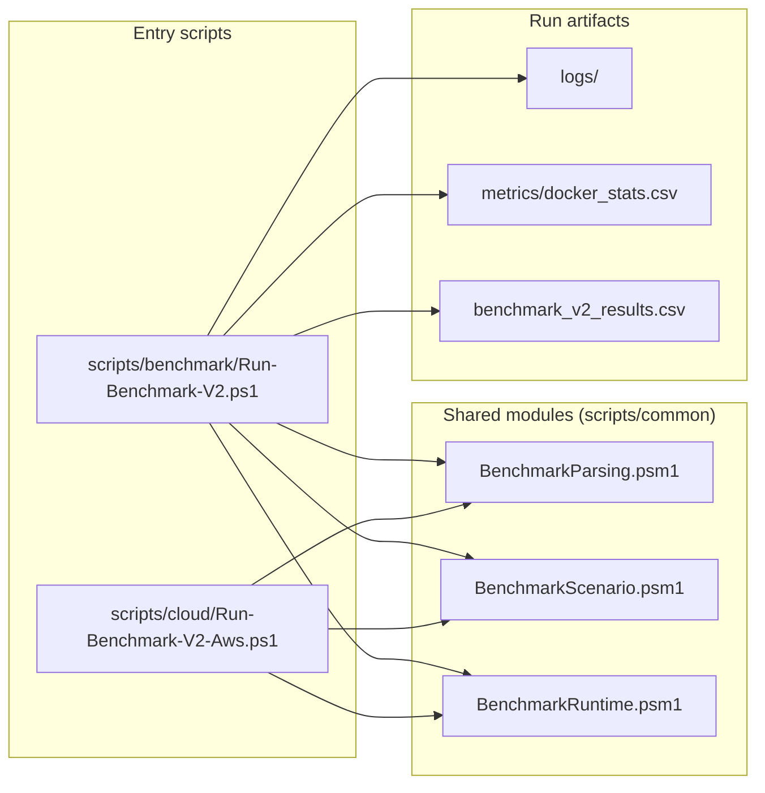

# Benchmark module interactions

This page describes how benchmark scripts are separated after modularization.

## Responsibility summary

- `BenchmarkParsing`: parse `FINAL`/`FINAL_SPACETIMEDB` lines and evaluate pass/fail criteria.
- `BenchmarkScenario`: cluster manager topology/env-line generation helpers.
- `BenchmarkRuntime`: runtime utilities for docker stats and log container naming.
- `Run-Benchmark-V2.ps1`: orchestration flow and loop control for local benchmark runs.
- `Run-Benchmark-V2-Aws.ps1`: cloud-oriented orchestration variant.

## Test coverage map

- `tests/BenchmarkParsing.Tests.ps1` covers parser and pass/fail rules.
- `tests/BenchmarkScenario.Tests.ps1` covers scenario/env generation.
- `tests/BenchmarkRuntime.Tests.ps1` covers runtime helper behavior.
